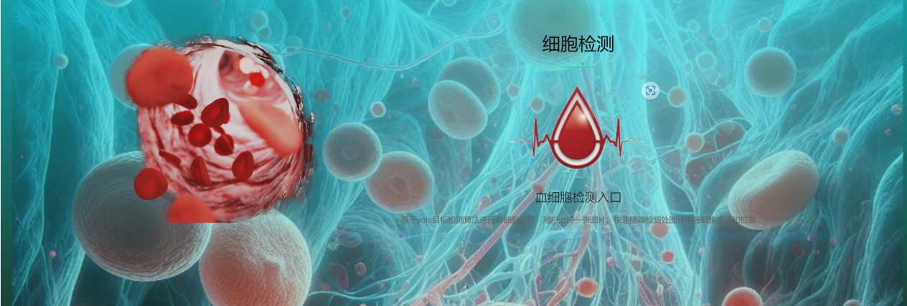
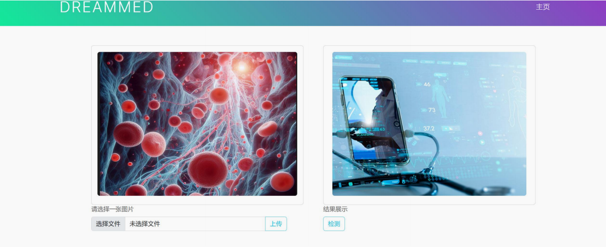
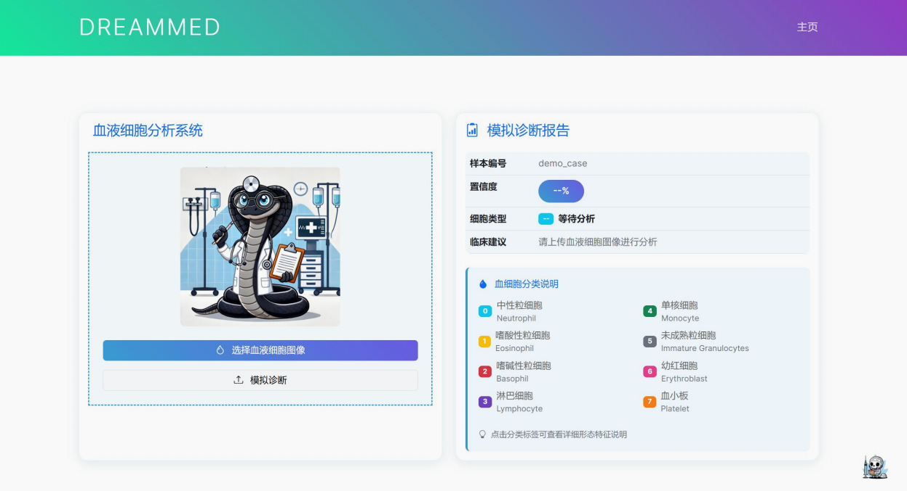
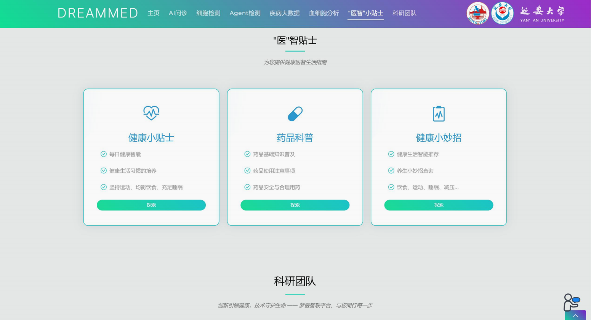
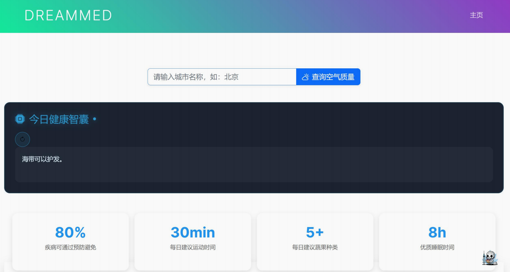
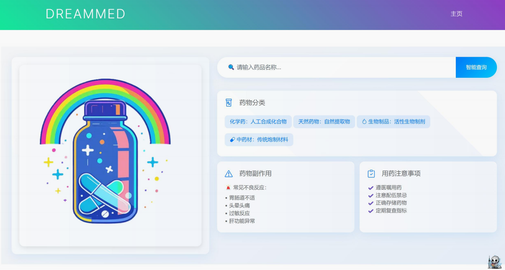
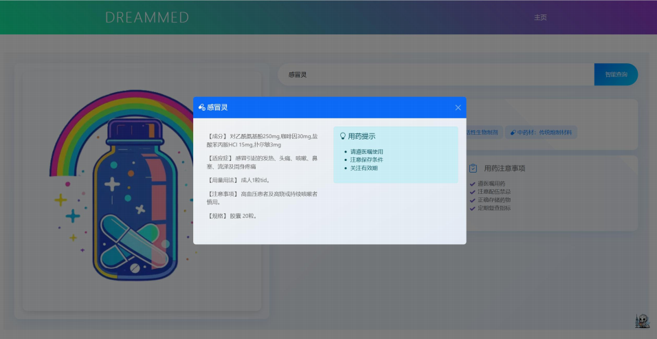
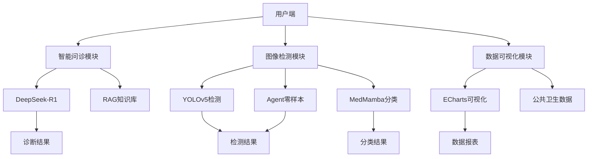

<div align="center">

# 🏥 DREAMMED (梦医智联)

**医疗大数据智能综合平台**


[简体中文](#-项目简介) | [English](#-overview)

*基于多模态大模型与状态空间模型的端到端医疗辅助决策系统*

</div>

---

## 📸 项目截图 (Screenshots)

<div align="center">
  
  <p><b>图1: 系统首页 - 简洁现代的医疗平台入口</b></p>
</div>

<table align="center">
  <tr>
    <td align="center"><br><b>智能问诊界面</b></td>
    <td align="center"><br><b>血细胞检测界面</b></td>
  </tr>
  <tr>
    <td align="center"><br><b>检测结果可视化</b></td>
    <td align="center"><br><b>Agent零样本检测</b></td>
  </tr>
</table>

<table align="center">
  <tr>
    <td align="center"><br><b>MedMamba细胞分类</b></td>
    <td align="center"><br><b>疾病大数据可视化</b></td>
  </tr>
  <tr>
    <td align="center"><br><b>医智贴士健康管家</b></td>
    <td align="center"><br><b>系统功能展示</b></td>
  </tr>
</table>

<table align="center">
  <tr>
    <td align="center"></td>
    <td align="center"></td>
  </tr>
  <tr>
    <td align="center" colspan="2"><br><b>更多系统功能展示</b></td>
  </tr>
</table>

---

## 📖 项目简介

**梦医智联 (DREAMMED)** 是一款集成自然语言处理、计算机视觉与大数据分析的医疗大数据智能综合平台。针对传统医疗系统中存在的诊疗效率低、优质医疗资源分布不均以及 AI 医疗产品"黑箱"不可解释等痛点，本项目提出了一套全链条的医疗辅助解决方案。

系统围绕"智能问诊 → 图像检测 → 疾病分类 → 数据可视化 → 健康管理"的闭环路线，深度融合了 DeepSeek 大模型问诊、YOLO 目标检测、Agent 零样本推理及创新的 MedMamba 医学图像分类架构，实现 7×24 小时的全方位在线多层次辅助诊疗服务。

### 🎯 核心痛点解决

| 痛点 | 解决方案 |
|:---:|:---|
| 诊疗效率低 | AI 智能问诊响应 < 1.2s，大幅提升诊疗效率 |
| 医疗资源分布不均 | 7×24 小时在线服务，打破地域限制 |
| AI "黑箱"不可解释 | 多维度可视化展示，诊断过程透明可追溯 |

---

## ✨ 核心特性

### 🧠 AI 智能问诊 (基于 DeepSeek-R1 与 RAG 工作流)

结合海量权威医学知识库（超 50 万条结构化指南及文献），通过 RAG（检索增强生成）技术与细粒度专家分割策略，支持长上下文症状解析与多轮临床推理问诊，单次诊断响应低于 1.2 秒。

### 🔬 高精度血细胞检测 (基于 YOLOv5 优化架构)

利用改进版的 YOLOv5 架构，融合多尺度特征提取与注意力机制，精准定位红细胞、白细胞及血小板，克服细胞重叠与染色不均难题。

### 🎯 Agent 零样本目标检测

首创 Prompt 驱动的人机交互检测范式。无需预标注数据集，仅需输入自然语言指令（如"检测异常增生细胞"或"Effusion"），系统即可通过语言-视觉双模态语义对齐实现未知目标的精准定位。

### 🧬 MedMamba 血液细胞分类识别

首创融合 SS-Conv-SSM 模块，兼具局部纹理识别与长程依赖建模能力（O(n) 线性计算复杂度），在应对罕见、异形血细胞分类时表现出极高的细粒度辨识率与鲁棒性。

### 📊 疾病大数据可视化平台

实时对接国家公共卫生数据平台，采用 ECharts 渲染动态交互式图表，多维展现传染病发病率、地域分布与疾病发展趋势。

### 💊 "医"智贴士健康管家

集成国家药监局数据库与国家气象局接口，提供精准药品科普、实时空气质量查询及智能生活妙招推送服务。

---

## 🏗️ 系统架构

<div align="center">



</div>

---

## 🛠️ 技术栈

### 前端 (Frontend)

| 技术 | 说明 |
|:---:|:---|
| HTML5, CSS3, JavaScript (ES6) | 核心前端技术栈 |
| Bootstrap | 响应式 UI 框架 |
| jQuery, Ajax, WebSocket | 数据交互与实时通信 |
| ECharts | 数据可视化图表库 |

### 后端 (Backend)

| 技术 | 说明 |
|:---:|:---|
| Python - Django | Web 框架 |
| Nginx + uWSGI | 生产环境部署 (Ubuntu 22.04 LTS) |

### 人工智能与算法模型 (AI & ML)

| 模型 | 应用场景 |
|:---:|:---|
| DeepSeek-R1 | NLP/LLM 智能问诊 |
| YOLOv5 | 目标检测 - 血细胞定位 |
| Agent Framework | 零样本视觉推理 |
| MedMamba (SS2D) | 图像分类 - 细胞分类识别 |

---

## 📂 目录结构

```text
medical-diagnosis/
├── app_diagnosis/            # Django 智能问诊核心业务应用
├── app_detection/            # YOLOv5 血细胞检测相关视图与逻辑
├── app_zero_shot/            # Agent 零样本检测模块
├── app_classification/       # MedMamba 细胞分类服务
├── app_dashboard/            # 疾病大数据可视化视图
├── core_models/              # 核心算法与模型存放区
│   ├── deepseek_agent/       # 问诊大模型与知识库代码
│   ├── yolov5/               # 改进版 YOLOv5 网络结构定义
│   └── medmamba/             # MedMamba 网络架构及 SS-Conv-SSM 实现
├── static/                   # 静态资源 (CSS, JS, Images)
├── templates/                # 前端 HTML 模板
├── weights/                  # 模型权重文件存放目录 (需单独下载)
│   ├── yolov5_blood.pt
│   └── bloodmnist_medmamba.pt
├── manage.py                 # Django 入口文件
├── requirements.txt          # 依赖库清单
└── README.md                 # 项目说明文档
```

---

## 🚀 快速启动

### 1. 环境准备

确保您的本地环境具备 Python 3.10.15 并支持 GPU 加速：

```bash
# 克隆仓库
git clone https://github.com/Mengsanfen/medical-diagnosis.git
cd medical-diagnosis

# 创建并激活虚拟环境
conda create -n dreammed python=3.10.15
conda activate dreammed

# 安装依赖
pip install -r requirements.txt
```

### 2. 模型权重下载与配置

由于权重文件较大，未包含在 Git 仓库中。请将训练好的权重放入 `weights/` 目录：

| 权重文件 | 说明 |
|:---:|:---|
| `yolov5_blood.pt` | YOLOv5 检测权重 |
| `bloodmnist_medmamba.pt` | MedMamba 分类权重 |

> **注**：项目主要使用了 BCCD 与 MedMNIST 数据集进行训练

### 3. 数据迁移与运行服务

```bash
# 执行数据库迁移
python manage.py makemigrations
python manage.py migrate

# 启动 Django 测试服务器
python manage.py runserver 0.0.0.0:8000
```

访问 `http://127.0.0.1:8000/` 即可进入系统主页（免登录访问）。

---

## 📈 性能评测

| 模块 | 指标 | 数值 |
|:---:|:---:|:---:|
| 智能问诊 | 诊断响应时间 | < 15 秒 |
| 智能问诊 | 常见病覆盖率 | ≥ 95% |
| 血细胞检测 | 单图推理时间 | ≤ 1 秒 |
| 血细胞检测 | MAP@0.5 准确率 | 91.3% |
| MedMamba 分类 | 图像分类耗时 | ≤ 200ms/图 |
| MedMamba 分类 | 分类准确率 | ≥ 98.6% |
| Agent 推理 | 未知病灶定位误差 | ≤ 10 像素 |

---

## 📊 数据集

本项目使用了以下公开数据集进行模型训练与验证：

| 数据集 | 用途 | 链接 |
|:---:|:---:|:---:|
| BCCD | 血细胞检测 | [Kaggle](https://www.kaggle.com/datasets/paultimothymooney/blood-cells) |
| MedMNIST | 医学图像分类 | [官方仓库](https://github.com/MedMNIST/MedMNIST) |

---

## 🗺️ 路线图

- [x] AI 智能问诊模块
- [x] YOLOv5 血细胞检测
- [x] Agent 零样本检测
- [x] MedMamba 细胞分类
- [x] 疾病大数据可视化
- [x] 医智贴士健康管家
- [ ] 移动端适配优化
- [ ] 多语言国际化支持
- [ ] 模型轻量化部署

---

## 🤝 参与贡献

欢迎提交 Pull Requests 或开启 Issue 探讨项目优化。

```bash
# 1. Fork 本仓库
# 2. 创建特性分支
git checkout -b feature/AmazingFeature

# 3. 提交更改
git commit -m 'Add some AmazingFeature'

# 4. 推送到分支
git push origin feature/AmazingFeature

# 5. 发起 Pull Request
```

---

## 📄 许可证与版权

- 本项目基于 [MIT License](LICENSE) 协议开源
- Copyright © DreamMed Research. All Rights Reserved.

---

## 📬 联系方式

| 渠道 | 信息 |
|:---:|:---|
| 📧 Email | sfmeng1208@163.com |
| 👥 开发团队 | 王宇翔开发团队 |

---

<div align="center">

**⭐ 如果这个项目对您有帮助，请给我们一个 Star！⭐**

*Made with ❤️ by DreamMed Team*

</div>
